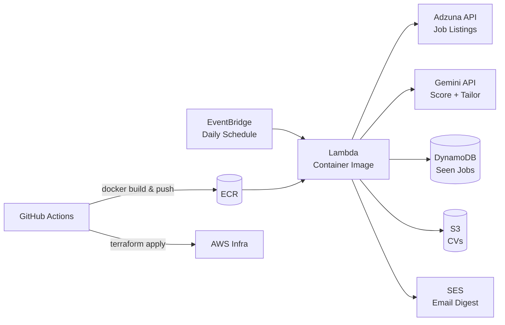

# Job Scout

A serverless job-search automation pipeline: it searches live job listings on a schedule, scores each one against my CV with an LLM, tailors a copy of my CV for strong matches, and emails me a digest — all running on AWS for effectively $0/month at this scale.

Built to demonstrate containerized AWS deployments and infrastructure-as-code with **Docker** and **Terraform**, provisioned automatically via a **GitHub Actions** CI/CD pipeline.

## Architecture



**Flow:** EventBridge triggers the Lambda daily → it pulls live listings from the Adzuna API → checks DynamoDB to skip anything already seen → scores unseen listings against my CV with Gemini → for matches above the threshold, generates a tailored CV and stores it in S3 → emails a digest via SES.

**Deploy path:** pushing to `main` triggers GitHub Actions, which builds the Docker image, pushes it to ECR, then runs Terraform to provision/update the AWS infrastructure and point Lambda at the new image.

## Tech stack

| Layer | Tool |
|---|---|
| Compute | AWS Lambda (container image) |
| IaC | Terraform |
| Containerization | Docker |
| CI/CD | GitHub Actions (OIDC auth to AWS, no long-lived keys) |
| Job search | Adzuna API |
| LLM (scoring + CV tailoring) | Google Gemini |
| Storage | S3 (CVs), DynamoDB (dedupe state) |
| Notifications | Amazon SES |
| Scheduling | EventBridge |

## Repo structure

```
.
├── app.py                          # Lambda handler
├── Dockerfile
├── requirements.txt
├── master_cv.example.txt           # template — copy to master_cv.txt (gitignored) and fill in
├── terraform/
│   ├── versions.tf                 # provider + backend config
│   ├── variables.tf
│   ├── main.tf                     # ECR, Lambda, DynamoDB, S3, EventBridge, IAM
│   └── outputs.tf
└── .github/workflows/deploy.yml    # build → push → terraform apply
```

## Running it yourself

### Prerequisites
- AWS account + [Terraform](https://developer.hashicorp.com/terraform/install) installed
- Docker
- Free API keys: [Adzuna](https://developer.adzuna.com/), [Google AI Studio (Gemini)](https://aistudio.google.com/)
- An SES-verified sender and recipient email (SES starts in sandbox mode)

### Option A — deploy locally with Terraform

```bash
cp master_cv.example.txt master_cv.txt   # fill in your real CV

cd terraform
terraform init
terraform apply \
  -var="gemini_api_key=..." \
  -var="adzuna_app_id=..." \
  -var="adzuna_app_key=..." \
  -var="ses_sender=you@example.com" \
  -var="ses_recipient=you@example.com"
```

First apply deploys the infra with a placeholder image tag. Build and push the real image, then re-apply pointing at it:

```bash
aws ecr get-login-password --region us-east-1 | docker login --username AWS --password-stdin <account_id>.dkr.ecr.us-east-1.amazonaws.com
docker build -t <ecr_repository_url>:v1 .
docker push <ecr_repository_url>:v1
terraform apply -var="image_tag=v1" -var="..."   # same vars as above
```

Upload your CV to the bucket Terraform created (see `terraform output s3_bucket_name`):

```bash
aws s3 cp master_cv.txt s3://<bucket-name>/cv/master_cv.txt
```

### Option B — CI/CD via GitHub Actions

1. Set up an [AWS IAM OIDC role](https://docs.github.com/en/actions/deployment/security-hardening-your-deployments/configuring-openid-connect-in-amazon-web-services) that trusts your GitHub repo, and add its ARN plus the API keys as repo secrets: `AWS_DEPLOY_ROLE_ARN`, `GEMINI_API_KEY`, `ADZUNA_APP_ID`, `ADZUNA_APP_KEY`, `SES_SENDER`, `SES_RECIPIENT`.
2. Push to `main`. The workflow builds the Docker image, pushes it to ECR, and applies the Terraform config automatically.
3. Upload your CV to S3 (step above) — this isn't automated on purpose, since it's personal data.

### Test a run manually

```bash
aws lambda invoke --function-name job-scout-auto --payload '{}' response.json
```

### Tear down

```bash
cd terraform
terraform destroy -var="..."   # same vars as apply
```

## Notes on design decisions

- **No headless-browser scraping.** An earlier version of this used Playwright to scrape job boards directly. Switched to a job-search API instead — smaller image, faster cold starts, and it doesn't break every time a site changes its HTML.
- **Dedupe via DynamoDB TTL.** Job IDs are marked seen with a 30-day TTL, so the table self-cleans instead of growing forever.
- **Least-privilege IAM.** The Lambda's role is scoped to exactly the S3/DynamoDB/SES actions it needs, not broad wildcards.
